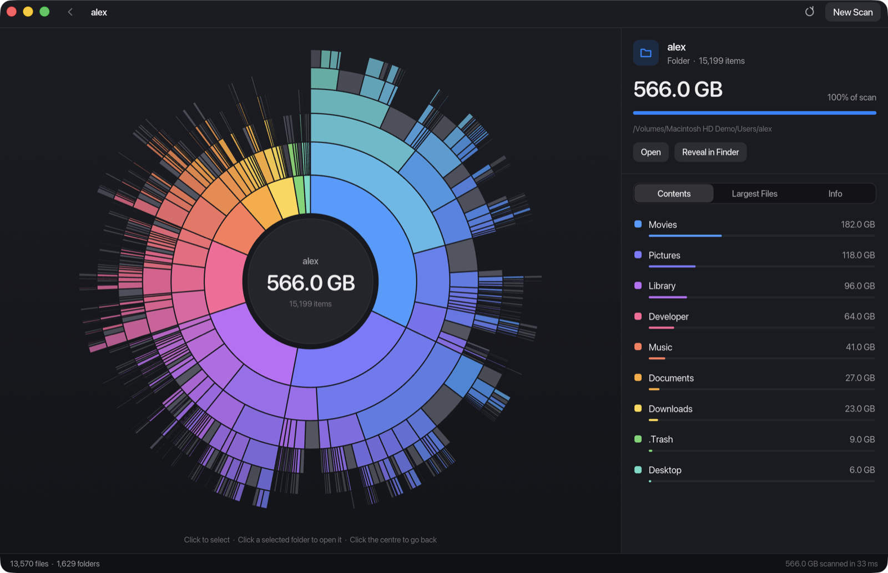
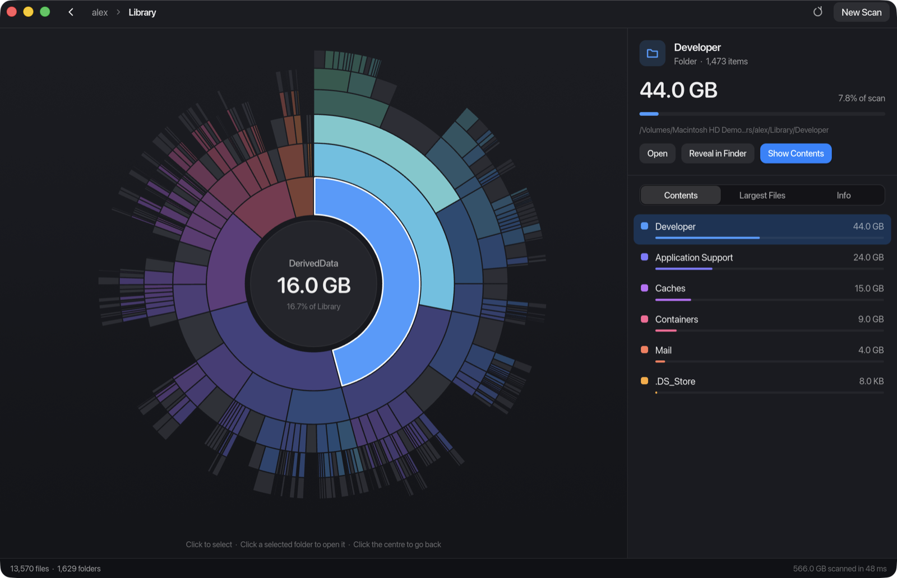

<p align="center">
  <picture>
    <source media="(prefers-color-scheme: dark)" srcset="assets/logo/logo-dark.svg">
    
  </picture>
</p>

<p align="center">
  <strong>See where your disk space went.</strong><br>
  A fast, free, open source disk usage visualizer for macOS, Linux, and Windows.
</p>

<p align="center">
  <a href="https://github.com/asweeney86/lorimer/actions/workflows/ci.yml"></a>
  <a href="LICENSE"></a>
  
</p>



Lorimer scans a folder and draws it as a sunburst. The folder you scanned is the centre, each ring is one level deeper, and the width of every segment is its share of the space. The big things are obvious at a glance, and you can click into any of them.

## Why Lorimer

- **Free and open source.** MIT licensed, with no paid tier, account, or trial.
- **Fast.** The scanner uses every core. On an M1 Max it covers a home folder of 8 million files in about 70 seconds. [Measurements below.](#performance)
- **Read-only.** Lorimer never deletes, moves, or changes anything. It shows you what is there and can open a file or reveal it in your file manager. What happens next is up to you.
- **Private.** It makes no network connections and collects no telemetry. It reads file names and sizes, never file contents.
- **Native.** Written in Rust and drawn on the GPU. There is no web view and no bundled browser.
- **macOS, Linux, and Windows from one codebase**, plus a command-line tool and a reusable scanning library.

## Install

### Download

Builds for each version are on the [releases page](https://github.com/asweeney86/lorimer/releases).

- **macOS** (Apple silicon and Intel): download `Lorimer-<version>-macos-universal.zip`, unzip it, and move `Lorimer.app` to Applications. The app is not notarized yet, so macOS blocks the first launch. Allow it under System Settings → Privacy & Security, or run `xattr -dr com.apple.quarantine /Applications/Lorimer.app`.
- **Linux** (x86_64): download `lorimer-<version>-linux-x86_64.tar.gz`. It contains the `lorimer` and `lorimer-cli` binaries, an icon, and a `.desktop` file.
- **Windows** (x86_64): download `lorimer-<version>-windows-x86_64.zip` and run `lorimer.exe`. The build is not signed, so SmartScreen may warn on first launch; choose More info, then Run anyway.

### Build from source

You need [Rust](https://rustup.rs) 1.88 or newer.

```bash
git clone https://github.com/asweeney86/lorimer.git
cd lorimer
cargo run --release
```

On macOS, `scripts/bundle-macos.sh` builds `target/release/Lorimer.app`.

On Linux, the Open and Reveal actions use `xdg-open`, and the folder picker uses the XDG desktop portal, which GNOME, KDE, and most other desktops provide.

## Using it

Pick the startup disk, one of the suggested folders, or any folder you like. While the scan runs you see a live count of the folders covered so far, and you can cancel it at any point.



- **Hover** a segment to see its name and size in the centre. Its path from the centre lights up and the rest dims.
- **Click** a segment, or a row in the sidebar, to select it. The sidebar shows its size, its share of the scan, and buttons to open it or reveal it in Finder, Explorer, or your file manager.
- **Click a selected folder again** to open it in the chart. Click the centre, the back button, or a breadcrumb to go back up.
- The sidebar tabs list the **contents** of the current folder (colored to match the chart), the **largest files** anywhere in the scan, and **details** such as dates and permissions.

| Shortcut          | Action                     |
| ----------------- | -------------------------- |
| `Cmd+O`           | Choose a folder to scan    |
| `Cmd+R`           | Scan the same folder again |
| `Esc` or `Cmd+Up` | Go to the parent folder    |
| `Esc` during scan | Cancel the scan            |

On Linux and Windows, use `Ctrl` in place of `Cmd`.

## Command line

The same scanner is available without the interface. This is a scan of the generated demo folder used for the screenshots above:

```console
$ lorimer-cli scan /Volumes/Demo/Users/alex/Movies
Scanned: /Volumes/Demo/Users/alex/Movies
Total size: 182.0 GB
Folders: 358
Files: 3046
Skipped: 0
Errors: 0
Elapsed: 2.6 s

Largest files:
      7.2 GB  /Volumes/Demo/Users/alex/Movies/Final Cut Projects/Iceland Documentary.fcpbundle/Index/clip_2821_0.zip
      7.0 GB  /Volumes/Demo/Users/alex/Movies/Final Cut Projects/Iceland Documentary.fcpbundle/IMG_6891_0.mp4
      6.7 GB  /Volumes/Demo/Users/alex/Movies/Exports/data_9371_0.psd
      ...
```

`lorimer-cli metadata <path>` prints size, dates, and permissions for a single file or folder. From a checkout, run it with `cargo run -p lorimer-cli -- scan <path>`.

## What the numbers mean

A disk usage tool is only useful if you know what it counts.

- **Sizes are logical file sizes**, the number `ls -l` reports. Sparse files, files the filesystem compresses, and APFS clones can occupy less space on disk than their logical size, so a folder's total can be larger than the space you would get back by deleting it.
- **Hardlinked files are counted once** on macOS and Linux, wherever the scanner meets them first. On Windows every link is counted, which mostly affects the `Windows` folder itself.
- **Symbolic links are not followed**, and neither are junctions on Windows. They are counted as skipped, so nothing is counted twice through a link.
- **A scan stays on one filesystem.** Other disks, network shares, and virtual filesystems such as `/proc` that are mounted inside the scanned folder are counted as skipped. On macOS, a scan of `/` reaches your data through the usual paths (`/Users`, `/Applications`) and does not count it again under `/System/Volumes/Data`.
- **Unreadable folders are counted, not hidden.** The status bar and the Info tab show how many items were skipped or could not be read. Scanning system locations without permission to read them will undercount them.
- **Small files are grouped.** To keep memory use in check on very large scans, only the largest files in each folder are kept individually; the rest appear as one "smaller files" entry with the correct total. The Largest Files list always covers the whole scan.

## Performance

Measured with the bundled benchmark, `scan-bench`, on a 2021 MacBook Pro (M1 Max, internal SSD, macOS 26):

| Scanned                      |       Files |      Folders | Time |
| ---------------------------- | ----------: | -----------: | ---: |
| A projects folder            | 3.5 million | 346 thousand | 27 s |
| A home folder                | 8.1 million |  1.1 million | 71 s |
| The whole startup disk (`/`) | 9.6 million |  1.5 million | 80 s |

On macOS the scanner reads directories with `getattrlistbulk`, which returns names, types, and sizes for many entries in one system call. Linux and Windows use the standard directory APIs; on Windows the listing already includes each file's size, so no file is opened. To measure your own machine:

```bash
cargo run --release -p lorimer-cli --bin scan-bench -- /path/to/dir
```

## Status

Lorimer is at version 0.1. The known gaps:

- macOS builds are not signed or notarized.
- Linux gets less day-to-day use than macOS. The tests run on every platform in CI, but please [report](https://github.com/asweeney86/lorimer/issues) anything that looks off.
- Windows support is new. It is built and tested in CI but has had little hands-on use, hardlinks are not deduplicated there, and `lorimer.exe` has no icon of its own in Explorer yet.

## Contributing

Bug reports and pull requests are welcome. [CONTRIBUTING.md](CONTRIBUTING.md) covers setup and what a pull request needs, and [docs/architecture.md](docs/architecture.md) explains how the code is put together.

| Crate                         | Role                                                                    |
| ----------------------------- | ----------------------------------------------------------------------- |
| [`lorimer-core`](crates/core) | Scanner, scan model, metadata, and platform actions. No interface code. |
| [`lorimer`](crates/gui-iced)  | The desktop app, built with [iced](https://iced.rs).                    |
| [`lorimer-cli`](crates/cli)   | Command-line frontend and the `scan-bench` benchmark.                   |

The logo files and icons are described in [assets/README.md](assets/README.md).

## License

[MIT](LICENSE)
